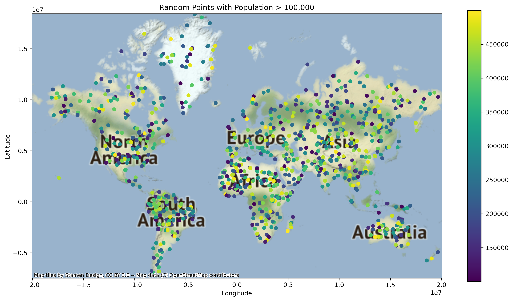
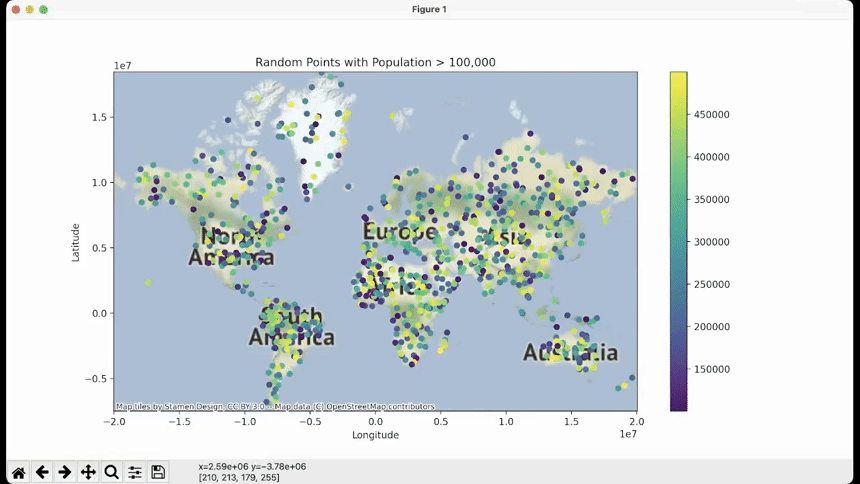

# Geospatial Data Visualization with GeoPandas

This project demonstrates how to generate a geospatial plot using Geopandas, Matplotlib, and Contextily. The plot displays random points with population greater than 100,000 on a world map.



## Dependencies

To run this project, you'll need the following Python packages:

- Geopandas
- Matplotlib
- Contextily
- Shapely

You can install these packages using `pip`:

```
pip install geopandas matplotlib contextily shapely
```

## Usage

To generate the geospatial plot, simply run the Python script `geospatial_data.py`:

```
python geospatial_data.py
```

This will create a geospatial plot with random points and population data, save it as `geospatial_plot.png` in the `output` folder, and display the plot in a window:



## Customization

You can customize the plot by modifying the `geospatial_data.py` script. For example, you can change the number of random points, the population range, or the colormap used for the plot.

## Contributing

We welcome your contributions to this project! If you have suggestions or improvements, please feel free to submit a pull request. For significant changes or new features, kindly open an issue first, so we can discuss your ideas in advance. As you contribute, please ensure that tests are updated accordingly. We appreciate your involvement and look forward to collaborating with you.

# License

This project is licensed under the MIT License.

# Acknowledgments

We extend our gratitude to the following individuals, projects, and organizations for their invaluable contributions:

- [GeoPandas library](https://geopandas.org/) for providing an exceptional geospatial data manipulation tool in Python.
- [The Contextily project](https://github.com/geopandas/contextily) for enabling the seamless integration of basemaps in our geospatial visualizations.
- [OpenStreetMap](https://www.openstreetmap.org/) and [Stamen Design](http://stamen.com/) for providing high-quality map data and styles, making it possible to create visually appealing and informative maps.

We also want to acknowledge the various AI tools and resources that provided prompt assistance and guidance throughout the development of this project, demonstrating the power of artificial intelligence in supporting developers and problem-solving.
